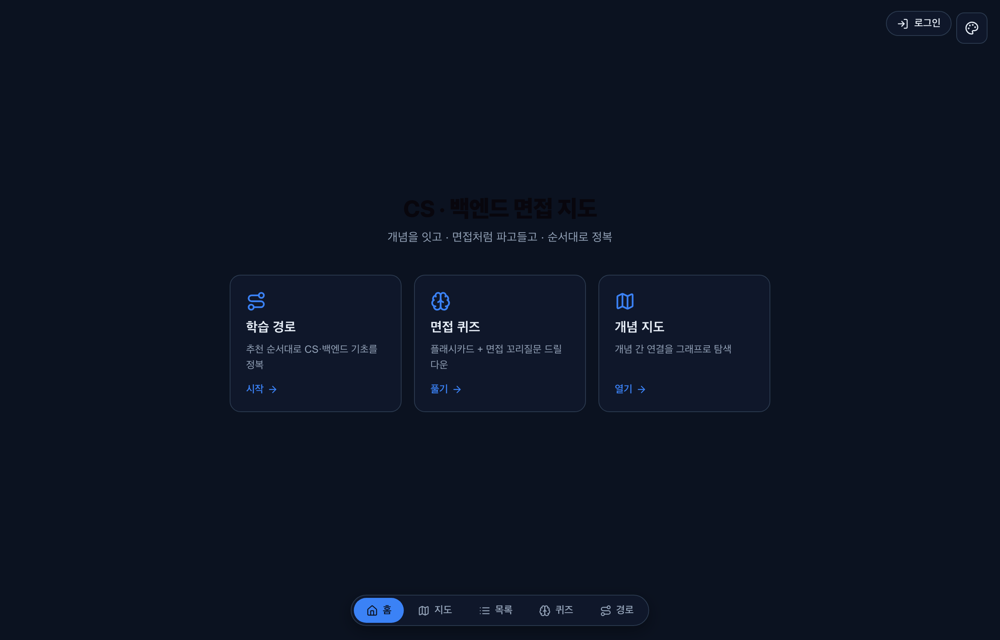
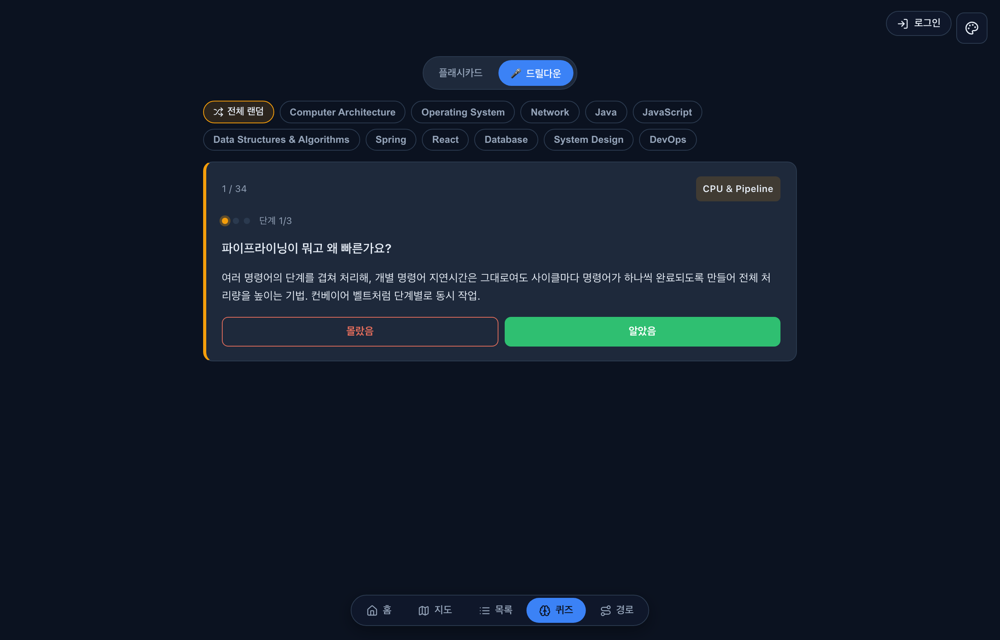
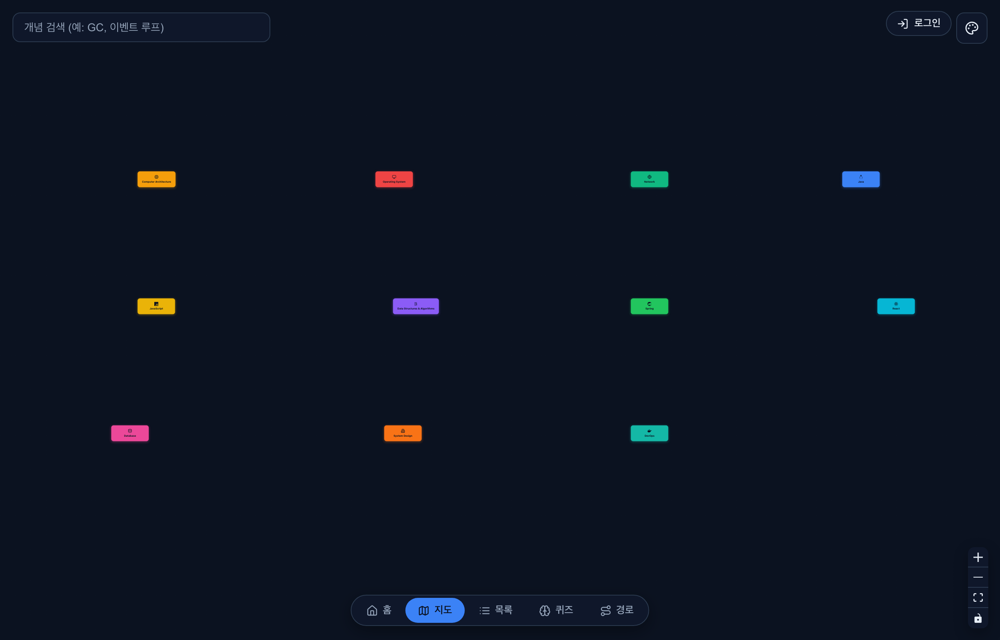

# cs-study

[](https://cs-study-eight.vercel.app)

한국 IT 백엔드 인터뷰를 준비하며 정리한 **CS 개념 노트 + 알고리즘 풀이 + 지식 그래프 학습 앱** 모음입니다.
주니어 개발자도 참고할 수 있도록 공개로 운영합니다.

> A public collection of CS interview notes, algorithm solutions, and an interactive
> knowledge-graph study app, written while preparing for Korean backend engineering interviews.

**▶ 라이브 데모: https://cs-study-eight.vercel.app**



---

## 🗺️ interview-map — 인터랙티브 학습 앱

CS 개념을 **연결된 지도**로 탐색하고, **면접처럼 파고들며**, **순서대로 정복**하는 웹앱입니다.
90여 개 개념 · 11개 도메인 · 336개 면접 Q&A를 하나의 앱에서 다룹니다.

### 학습 철학
> **반복 · 약점 집중 · 시간 최소화.** 아는 건 빠르게 넘기고, 못 푸는 흑·회색 영역을 정확히 짚어 반복합니다.

### 주요 기능

| 모드 | 설명 |
|------|------|
| 🏠 **홈** | 처음 온 사람도 바로 방향을 잡는 랜딩 |
| 🗺️ **지도** | 개념을 그래프로 탐색. Google Maps처럼 줌 아웃하면 도메인, 줌 인하면 하위 개념이 드러나는 **semantic zoom** + 도메인을 가로지르는 개념 연결(cross-link) |
| 📄 **목록** | 개념 노트를 섹션 아웃라인과 함께 정독 |
| 🧠 **퀴즈** | 날짜 시드 플래시카드 + 도메인별 약점 통계 |
| 🎤 **면접 드릴다운** | 메인 질문 → **꼬리질문 체인**을 실제 면접관처럼 한 단계씩. "몇 단계까지 버텼나"(생존 깊이)로 약점을 드러냄 |
| 🧭 **경로** | 큐레이션 코스(신입 백엔드 필수 등) + 도메인별 자동 코스, 진행 체크 |

진행 상황은 **게스트는 브라우저에**, **로그인하면 클라우드에** 저장됩니다(GitHub·Google OAuth, Supabase).

### 🎤 면접 드릴다운

실제 기술 면접은 "그건 왜죠?"로 답할 수 없을 때까지 파고듭니다. 드릴다운 모드는 이 흐름을 그대로 재현합니다 —
메인 질문에 답하면 꼬리질문이 이어지고, 처음 막힌 단계가 곧 당신의 약점입니다.



### 🗺️ 개념 지도 (semantic zoom)



### 개발

```bash
cd interview-map
npm install
npm run dev      # 개발 서버
npm run build    # 프로덕션 빌드 (tsc -b && vite build → dist/)
npm test         # 단위 테스트 (Vitest)
```

- 스택: React + TypeScript + Vite + [React Flow](https://reactflow.dev/) + Zustand, 인증/동기화는 [Supabase](https://supabase.com/).
- 그래프 구조는 [`interview-map/src/graph/graph.json`](interview-map/src/graph/graph.json) 한 곳에서 관리하고,
  각 노드는 [`notes/`](notes/)의 마크다운을 참조합니다 (내용 중복 없음).

---

## 📁 구성

| 경로 | 내용 |
|------|------|
| [`notes/`](notes/) | CS 개념 노트 — Java/JVM · OS · Network · DB · Spring · System Design · DevOps · Hardware · DSA · React · JavaScript (면접 답변 형식) |
| [`01-data-structures/`](01-data-structures/) | 알고리즘 풀이 코드 (BOJ, Java 11) |
| [`STUDY_PLAN.md`](STUDY_PLAN.md) | 12주 알고리즘 학습 일정 |
| [`interview-map/`](interview-map/) | 지식 그래프 학습 웹앱 |

## 📝 노트 작성 방식

각 노트는 일관된 순서를 따릅니다: **비유 → 개념 정의 → 다이어그램 → 코드 → 핵심 포인트/자주 하는 실수 →
패턴 정리표 → 예상 면접 질문(+ 꼬리질문)**. 한국어 설명 + 영어 코드.

가장 완성된 예시: [`notes/01-java-jvm/jvm-memory-gc.md`](notes/01-java-jvm/jvm-memory-gc.md)
(JVM 구조 · Class Loader · GC · JIT · 동시성).

---

학습용 공개 저장소입니다. 오류를 발견하면 이슈로 알려주세요.
